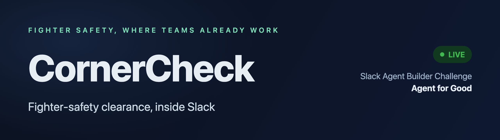
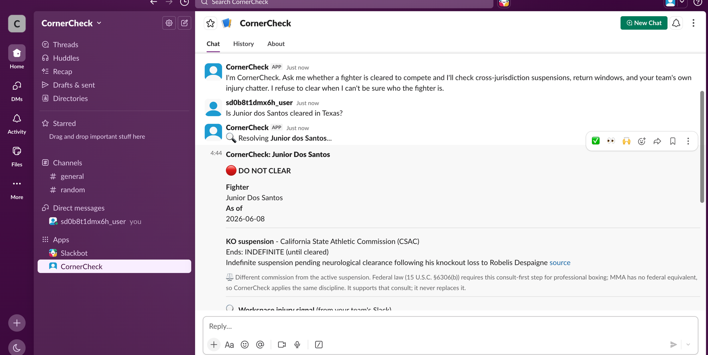
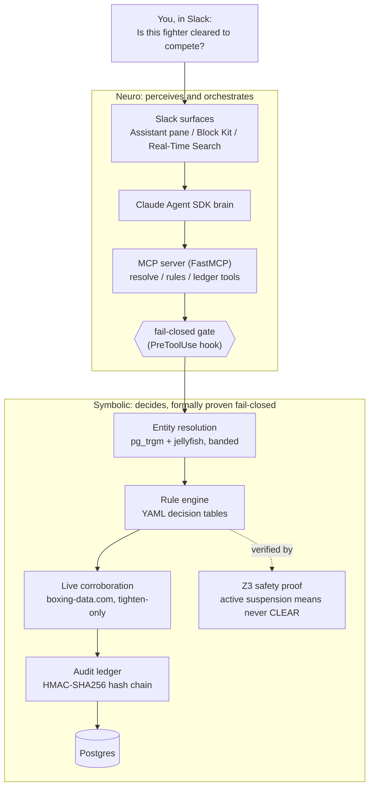

<p align="center">
  
</p>

<p align="center">
  <a href="https://github.com/StephenSook/cornercheck/actions/workflows/ci.yml"></a>
  
  
  <a href="LICENSE"></a>
  <a href="https://cornercheck.onrender.com"></a>
</p>

A Slack-native AI agent that helps fight-operations teams, matchmakers, and athletic
commissions confirm whether a combat-sports athlete is safe and cleared to compete. It catches
the cross-jurisdiction medical suspension a team would otherwise miss, and **refuses to clear a
fighter when it cannot be sure who they are.**

Built for the Slack Agent Builder Challenge, **Slack Agent for Good** track. Live for judging: the
agent runs inside Slack, and [cornercheck.onrender.com](https://cornercheck.onrender.com) is its
live public dashboard: real stats from the real database, the audit chain verified at page load,
and the Z3 safety proof you can run yourself, right there, in milliseconds.

> CornerCheck is **decision support**. A human always makes the final call, and every decision
> lands in a tamper-evident, hash-chained audit ledger.

## The problem

Suspension records in boxing and MMA live in official databases, but nothing checks them
automatically when a bout is booked. A fighter knocked out under one commission can still be
booked under another before the mandatory medical hold expires. For
professional boxing, federal law (15 U.S.C. §6306(b)) requires the licensing commission to
consult the suspending one first; in practice that step is often skipped, and MMA has no federal
equivalent at all. In 2017, boxer Tim Hague died after a knockout in Edmonton; his prior medical
suspension had lapsed days earlier and he fought as a late replacement. The 2024 fatality inquiry
called for a single registry of fighters' medical and bout histories. CornerCheck brings that
consult-first discipline to where fight operations already coordinate: Slack.

## What it does

- **Catches cross-jurisdiction suspensions** against curated, source-cited public commission
  records. When the booking commission differs from the suspending one, it surfaces the
  consult-first step: binding federal law for boxing (15 U.S.C. §6306(b)), and for MMA the same
  discipline applied where no federal rule exists.
- **Enforces return-to-competition windows** from Association of Ringside Physicians / ABC
  guidance (30 days after a TKO, 60 after a KO, 90 after a KO with loss of consciousness, plus
  stricter state overlays), encoded as data-driven decision tables.
- **Surfaces injury signals from the team's own Slack** via the Real-Time Search API, with
  permalink citations, so a "got rocked in sparring Tuesday" message does not get lost.
- **Refuses to clear an ambiguous identity.** Two pro fighters share a name; CornerCheck shows
  the candidates and asks a human to pick. A wrong "cleared" can be fatal; a wrong "refused"
  costs a phone call.

<p align="center">
  <br>
  <em>A cross-jurisdiction block in Slack: the cited suspension, the consult-first note, and an audit reference.</em>
</p>

## Architecture

CornerCheck is a **neurosymbolic** system: the language model perceives natural language and
orchestrates tools, but the clearance decision itself comes from a deterministic, formally
verified symbolic core. The model proposes; the proven core disposes. That separation is what
lets the fail-closed guarantee be code, not a prompt.



Every Slack surface here is load-bearing: the **Assistant** pane and **Block Kit** (verdict
cards, the whole-card board, a disambiguation picker, a Data Table audit view, and a "See the
safety proof" button that runs the Z3 proof live), one **Model Context Protocol** server the
Claude agent orchestrates, **Real-Time Search** for the injury signal, **Canvas** for the
exportable audit trail, **Incoming Webhooks** for the daily roster-monitor digest, and a
**Workflow Builder custom step** ("Check fighter clearance") that gives any workflow the same
fail-closed verdict and halts the workflow on any error, because a halted workflow cannot book
a fighter.

**Three independent fail-closed locks** each block a wrong clearance, so no single failure can
produce one: an in-tool engine re-check (refused writes are themselves ledgered), a deterministic
PreToolUse hook, and a pipeline whose card renders only from the engine, never from model prose.
See [`docs/architecture.md`](docs/architecture.md) for the full write-up.

**The agent watches the roster, not just the question.** A daily in-process monitor re-checks
every suspension window (lapsing within 14 days, lapsed within the last 7: the failure mode that
killed Tim Hague was a lapsed window nobody re-verified) and diffs the ledger and the suspensions
table since its own last run (new DO NOT CLEAR verdicts, live-record disagreements, newly filed
suspensions). Every
trigger is deterministic arithmetic; no model decides or phrases an alert, and quiet days send
nothing. Each run is itself written to the append-only ledger, and the digest pushes to an ops
channel via incoming webhook, fail-quiet.

**A live second source corroborates, one-way.** Boxing verdicts are checked against the live
boxing-data.com record (cached, deterministic comparison, no LLM involved). A disagreement
(the live source showing more bouts than the record on file, the classic stale-record failure)
**tightens** the verdict: a CLEAR is withheld pending commission verification. Live data being
unavailable, unmatched, or not applicable (MMA) only annotates; absence of evidence never blocks
and nothing the live source says can ever loosen a verdict. The full corroboration evidence is
written to the audit ledger with every decision.

## Verification

The clearance decision logic is checked by **Z3**: the engine's suspension-window membership is
proven equivalent to an independently-written safety specification over all dates and intervals,
so if a suspension is active on the date, the engine can never return CLEAR. The proof is not a
tautology (an in-suite mutation test confirms it catches engine corruption), and it earned its
keep: it surfaced a real fail-open bug, a malformed `end < start` date range that silently cleared
a suspended fighter, now fixed to fail closed.

```bash
uv run python scripts/z3_proof_demo.py   # proves the invariant, then plants a bug and watches Z3 catch it
```

The proof is also runnable IN the product: every verdict card carries a "See the safety proof"
button that runs the live Z3 check (about 4 ms) plus a non-vacuity control (a deliberately
loosened boundary that must yield a counterexample). A failed proof renders as an alarm, never
as reassurance.

The identity half carries its own formal backing: the match threshold is not hand-tuned but
**conformally calibrated** against the real fighter table (split conformal prediction; the
nonconformity quantile over 4,203 real query/fighter pairs). A match is certified only when the
calibrated prediction set is a singleton, so with 95% coverage (marginal, conditional on
retrieval) the true fighter is in the set, and any statistically plausible runner-up forces a
human pick: Chow's reject rule with a guarantee instead of a guess. The committed artifact's
holdout estimate is 95.1%. The gate composes tighten-only: it can demote a confirmation, never
promote one.

```bash
uv run python scripts/calibrate_er.py --check   # recomputes the calibration and verifies the committed artifact
```

## Quickstart

```bash
uv sync                       # install (Python 3.12)
docker compose up -d          # local Postgres
uv run python seeds/seed_db.py --force   # 4,107 real fighters + 54 cited suspension cases
uv run pytest                 # 252 tests
uv run ruff check . && uv run ruff format --check . && uv run mypy src tests
```

To run the agent you need a Slack app (Socket Mode) and an Anthropic API key; copy `.env.example`
to `.env` and fill it in, then `uv run python -m cornercheck.app.main`.

Pre-commit hooks (ruff, gitleaks) run locally; on every push, CI re-runs lint, mypy, the full
suite against a real Postgres service, a build, and a full-history secret scan.

## Project layout

```
src/cornercheck/
  app/          Slack surface: Assistant handlers, Block Kit cards, actions, mentions,
                Workflow Builder step, App Home, the public dashboard HTTP server
  brain/        Claude Agent SDK session, PreToolUse fail-closed hook, deterministic pipeline
  mcp_server/   one FastMCP server, the agent's tool surface
  rules/        YAML decision-table rule engine (clearance rules are data, not code)
  er/           entity resolution (pg_trgm + jellyfish, banded + conformal identity gate)
  sources/      live corroborating sources: boxing-data.com client, cache, recorded fixtures
  search/       Real-Time Search injury scan (workspace chatter, spotlighted as untrusted)
  session/      per-thread confirmation state behind the ledger gate
  db/           Postgres pool, typed queries, ordered SQL migrations
  ledger/       HMAC-SHA256 hash-chained audit ledger + verifier (metadata-stamped)
  verification/ Z3 safety proof
tests/          unit, property (Hypothesis), integration, formal (Z3)
docs/           architecture, decisions log, demo script, submission writeup
```

## Built with

Python 3.12, Slack Bolt (Assistant, Socket Mode), Block Kit, Real-Time Search, Claude Agent SDK,
FastMCP (Model Context Protocol), Postgres (pg_trgm, jellyfish), Z3, Hypothesis, Render.

## Responsible AI

CornerCheck is decision support, never a diagnosis or a replacement for a commission or a ringside
physician. The model cannot decide clearance: the verdict is computed by the deterministic engine
and gated by code. Every blocking suspension is shown with its source. Workspace search results
are treated as untrusted data, cited by permalink and never stored. Identity ambiguity, an
unreachable database, and a timed-out reasoning step all resolve toward "not cleared."

## License

[Apache-2.0](LICENSE).
