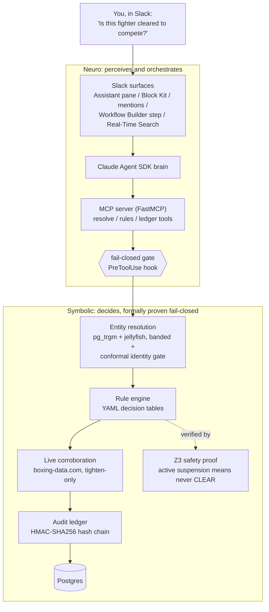

# Architecture

CornerCheck is a neurosymbolic system: the language model perceives natural language and
orchestrates tools, but a deterministic, formally-verified symbolic core decides clearance.
The model proposes; the proven symbolic core disposes. That separation is what lets the
fail-closed guarantee be code, not a prompt.

## The three fail-closed locks

The "fail-closed guarantee" is not a single check. Three independent mechanisms each block a
wrong clearance, so no single failure can produce one:

1. **In-tool engine re-check.** The ledger-write tool re-runs the rule engine PLUS the same
   tighten-only corroboration composition and refuses any decision that contradicts the
   composed verdict. Refused writes (including malformed-id and unknown-fighter probes) are
   themselves ledgered.
2. **PreToolUse hook.** The agent cannot write a clearance unless this thread confirmed this
   fighter and the recorded verdict matches the decision being written. Deterministic code; the
   model cannot talk its way around it.
3. **Deterministic pipeline.** The Slack card renders from the deterministic
   Retrieve, Disambiguate, Clear pipeline, never from model prose. Ambiguous identity or no
   match never reaches the rule engine.

A deliberate consequence of lock 2: the freeform (agentic) path can never pass the ledger
gate, because only the deterministic pipeline confirms fighters into the session. The agent
can read every tool; only the pipeline writes clearance decisions.

## Identity: certified, not hand-tuned

Entity resolution retrieves high-recall candidates (pg_trgm, exact-name matches ordered
first so same-name twins can never be split by the LIMIT), scores them with Jaro-Winkler,
and bands the result. A legacy CONFIRMED is then certified by a split-conformal gate
calibrated on query variants built from the real fighter table: confirmation requires a
SINGLETON prediction set at the calibrated coverage level; a statistically plausible
runner-up demotes to a human pick. The gate composes tighten-only (it can demote, never
promote) and disables itself, annotated, when its committed artifact is missing or invalid.

## A second source that can only tighten

Boxing verdicts are corroborated against the live boxing-data.com record (Postgres-cached,
deterministic comparison, no LLM). A disagreement tightens a CLEAR into DO_NOT_CLEAR pending
commission verification; unavailability or absence of evidence only annotates. Nothing the
live source says can ever loosen a verdict, and the evidence rides along in every ledger
write.

## The roster monitor

A daemon thread ticks hourly, gated by the ledger to roughly one run per day: window
arithmetic over every suspension (lapsing/lapsed), plus exact ledger diffs from a
seq-watermark (new suspensions, new blocks, live-record disagreements). Every trigger is
deterministic; quiet days send nothing. Each run is itself ledgered, and the ops digest
carries the chain head (seq + hash) as an external tamper anchor in Slack message history.

## The audit ledger

Append-only (trigger-enforced) with an HMAC-SHA256 hash chain. Each entry's hash covers the
previous hash and the payload, which includes a `_meta` stamp (actor, action, app-time), so
edited columns on stamped rows, including a backdated timestamp, break verification.
Verification reports the FIRST broken seq exactly. The trail exports to a Slack Canvas on
one click, chain-verified at export time.

## Verification

The clearance decision logic is checked by Z3, live in-product (the "See the safety proof"
button and the public `/api/proof` endpoint run it on demand in milliseconds): the engine's
suspension-window membership is proven equivalent to an independently-written safety
specification over all dates and intervals, so if a suspension is active, the engine can
never return CLEAR. The proof is not a tautology (an in-suite mutation test plus a live
negative control confirm it catches corruption), and it surfaced a real fail-open bug (a
malformed `end < start` date range that silently cleared a suspended fighter), now fixed to
fail closed. The rules YAML itself validates at load and refuses to start on a missing or
malformed table, so no typo can become a zero-day window.

## Diagram assets

Rendered presentation versions of this diagram and the demo title/end cards live in
`docs/demo-assets/` (1920x1080 PNGs, regenerable from the committed HTML with headless Chrome).
